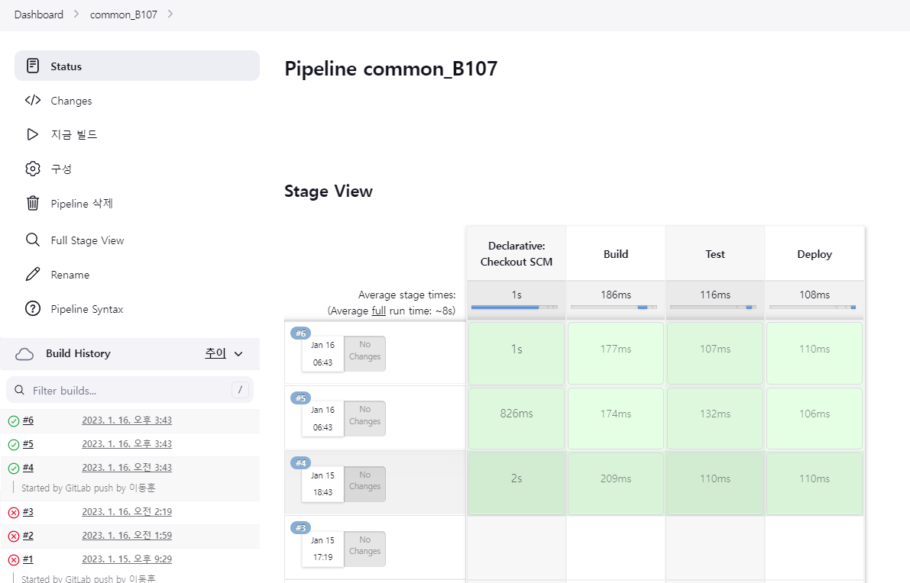

### EC2, RDS 생성 및 연결

EC2 프리티어 조건에 맞춰서 만들기 (t2.micro, 30GB)

RDS 프리티어 조건에 맞춰서 만들기 (t4g.micro, 20GB, 용량먹는거 다 해제)

이후 두개 연결

### ssh로 EC2 연결 후

Docker 설치 [관련 라이브러리 설치]

docker-compose 설치 및 yml 생성

### jenkins-lts 이미지를 가져와 Docker Container 생성 (DooD 방식)

```jsx
sudo docker run
-d
-p 8080:8080
-v /jenkins:/var/jenkins_home
-v /var/run/docker.sock:/var/run/docker.sock
--name jenkins_dood
-u root
jenkins/jenkins:lts
```

### DinD || DooD

container인 jenkins 내부에 docker 명령어가 필요하기 때문에, DinD 혹은 DooD로 볼륨 연결 필요

- docker-ce, docker-cli는 jenkins container에서는 no candidate 뜨더라.
- [docker.io](http://docker.io) 설치하니 명령어 인식 됐었음

### docker-compose.yml에 volume 연결 및 상세 설정 작성

- 앞으로는 yml에 이미지들을 등록시키고 한번에 구동시킬 것임
- docker-compose up -d로 실행. (-d 옵션은 백그라운드 실행을 의미)
- (하나만 키려면 docker run -d -p [포트:포트] -v [젠킨스경로] -v [docker.sock:docker.sock] ~~ 하략)

```jsx
version: "3"
services:
  jenkins_dood:
    image: jenkins/jenkins:lts
    user: root
    volumes:
      - /jenkins:/var/jenkins_home
      - /var/run/docker.sock:/var/run/docker.sock
    ports:
      - 8080:8080
```

- 근데 이거로 docker-compose up -d 하고 나면 이름이 ubuntu_jentins_dood_1이 되더라
    
    

### Gitlab(Github) 플러그인 + Docker 플러그인 설치

- k8s는 구현하지 않음

### New Credential

- Credential을 만들어준다. token은 버그 걸렸으니 user+pwd와 aws의 경우 secret text (ID, SecKey 둘 다)
- SVM의 Test가 Success가 뜨는지 확인

### Web Hooks 연결

- Jenkins에서 Generate Secret Key인가 그거 하면 나오는 Key를 Gitlab의 Web Hooks에 넣으면 됨
- push event라던지 언제 hook가 발동될 것인지 고르고 Test 클릭했을때 200 OK뜨면 된다

### Jenkinsfile 작성

1. pipeline agent ~ (declared script, groovy 몰루ㅇㅋ 신규 문법) // 여기서 agent란 부려먹을 노예
2. node stage ~ (groovy script, 유연하나 어려운 기존 방법)
- 현재 프론트/백을 만들어둔게 없으므로 테스트용 빌드만 시켜둠

### 결과 - 빌드 성공

- 아직 구동 시킬 Client/Server 부재로 Test용 pipeline script 삽입 및 시행
