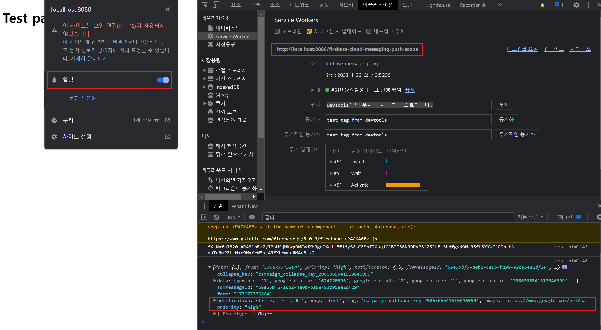
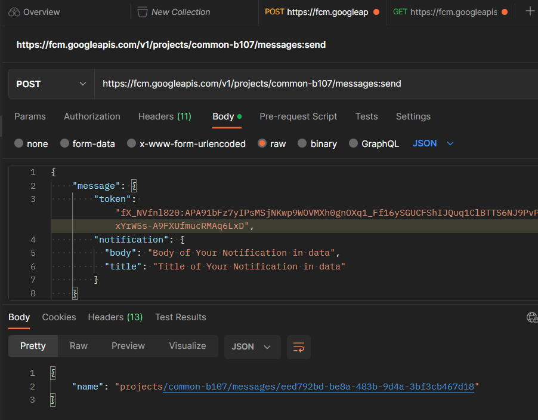
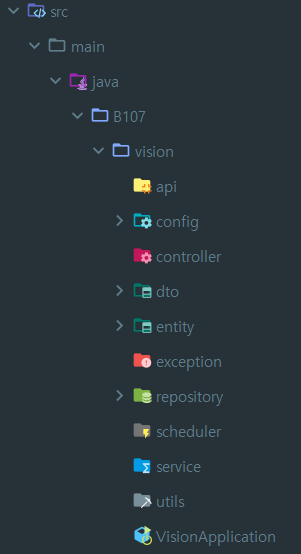
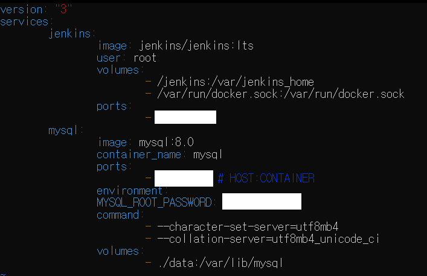

## 2023-01-25
### 1. ERD 제작

### 2. SSAFY 측 제공 EC2 ssh 접근 확인 완료
    2-1) docker를 이용한 이미지 올릴 예정
    - Jenkins
    - Nginx
    - MySQL

## 2023-01-26
### 1. FCM 테스트

1-1) (Firebase Console) 테스트 성공
- FCM TOKEN은 Console에서 획득 성공. Firebase Console에서 Test 완료 후 JSON 수신 확인 완료
- ACCESS TOKEN / REFRRESH TOKEN은 OAUTH 2.0 Playground에서 임시로 확보 후 Test하였음
- Push가 안되는 문제 해결 필요. Service Workers는 제대로 켜져 있는 듯 한데, 문제가 무엇일까

1-2) (Postman) 테스트 성공

- API 통신으로 Browser의 Console에 JSON 수신 확인 완료
- Push가 안되는 문제 해결 필요. Service Workers는 제대로 켜져 있는 듯 한데, 문제가 무엇일까

1-3) 비슷한 개념 키워드
- PWA
- web push 라이브러리

## 2023-01-27
### 1. Back-end
- 폴더 구조 생성

- Test용 localhost DB 연결 및 Datasource 할당 확인, hibernate ddl 연동 확인

### 2. 지급받은 EC2
- Docker 및 docker-compose 설치
- docker-compose.yml 작성 (Jenkins, MySQL)

- 퍼블릭 IP 및 접근경로 확인 완료
